

# Datos de los alumnos

### Estudiante 1

> * Jesús Morales Villegas
> * jmv00037@red.ujaen.es

### Estudiante 2

> * Francisco José Jordán Jiménez
> * fjjj0001@red.ujaen.es

### Estudiante 3

> * Francisco Javier Jiménez Aznar
> * fjja0004@red.ujaen.es

### Estudiante 4

> * Emilio Martínez Conchillo
> * emc00073@red.ujaen.es

### Estudiante 5

> * Miguel Ángel Hurtado Molina
> * mahm0010@red.ujaen.es

# Datos de Trello

> URL del tablero de Trello: https://trello.com/b/OxFdYMoj/pr%C3%A1ctica-4-da

# Incremento

> Fecha de inicio: **25/04/2023**  
> Fecha de fin: **18/05/2023**

### **Captura inicial del tablero**

**Nota:** al comienzo del sprint nos confundimos y sólo hicimos una captura con todas las HU en el Product Backlog. Nuestra idea era hacerlas todas, por lo que para hacer la captura con todas las HU en el Sprint Backlog hemos tenido que mover las tarjetas el último día.

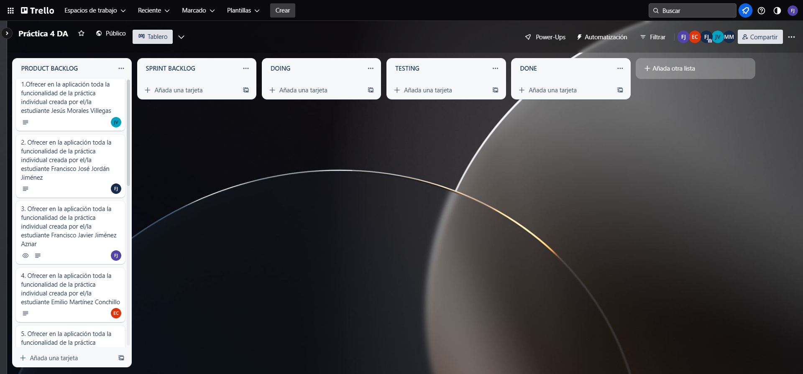
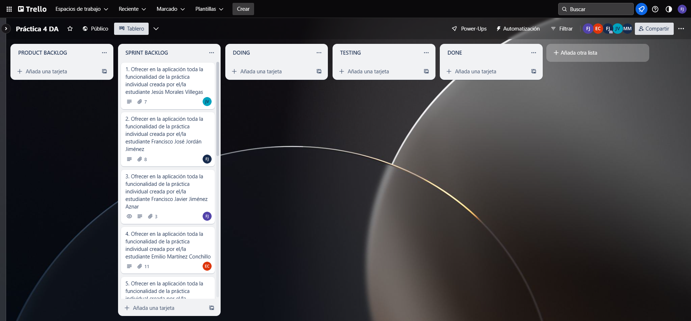

### **Captura final del tablero**

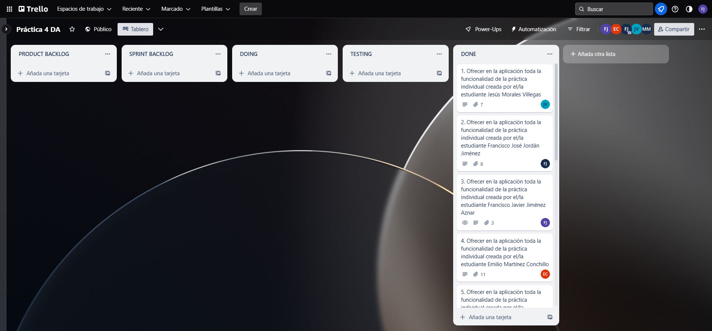

# Documentación de las Historias de Usuario

En este incremento se han realizado todas las historias de usuario.

## **HU 1. Ofrecer en la aplicación toda la funcionalidad de la práctica individual creada por el/la estudiante Jesús Morales Villegas**

Para acceder a las funcionalidades hay que pulsar el boton de mostrar opciones de boxeo
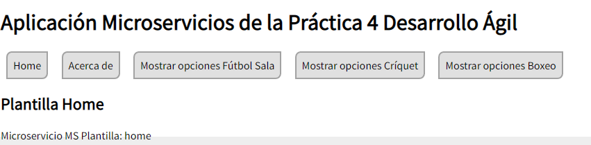
Al pulsar sobre Listar boxeadores aparece lo siguiente, las funcionalidades siguen funcionando
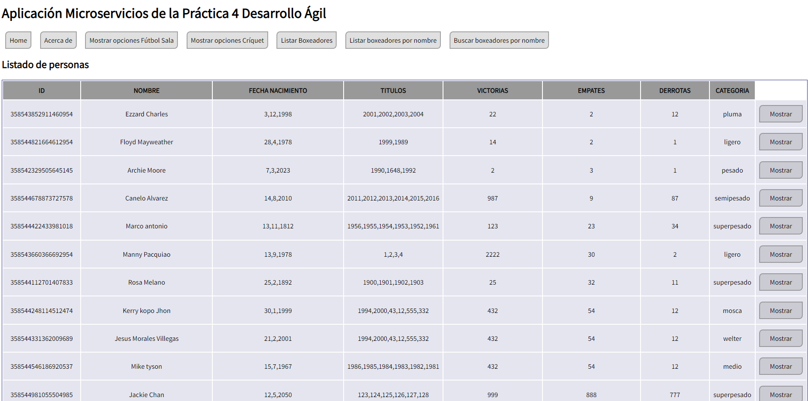
Al pulsar sobre mostrar aparece lo siguiente
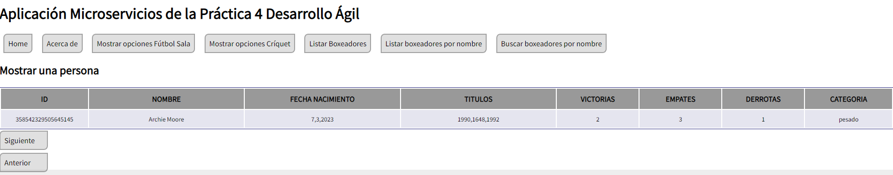
Al pulsar sobre Listar boxeadores por nombre aparece lo siguiente, y si se pulsa en ordenar ordena alfabéticamente
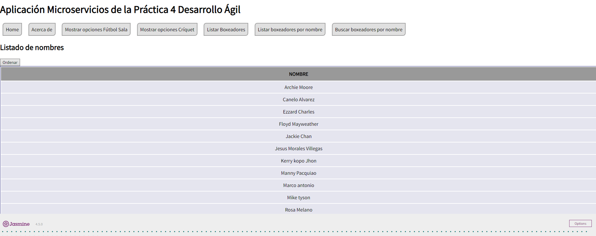
Aqui ordenado
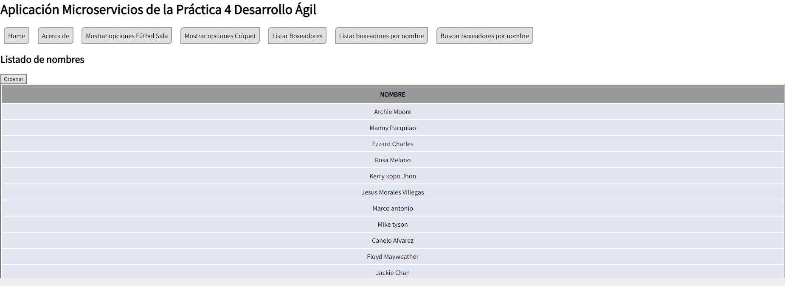
Al pulsar sobre buscar boxeadores por nombre aparece el buscador
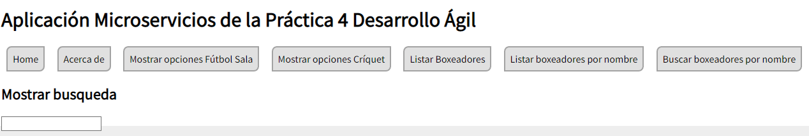
Si se introduce en el buscador la cadena de texto "Canelo" aparece lo siguiente
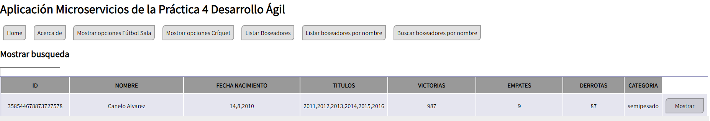

## **HU 2. Ofrecer en la aplicación toda la funcionalidad de la práctica individual creada por el/la estudiante Francisco José Jordán Jiménez**

La página muestra un botón que al pulsarlo despliega los botones de mi práctica

Las funcionalidades siguen funcionando correctamente

## **HU 3. Ofrecer en la aplicación toda la funcionalidad de la práctica individual creada por el/la estudiante Francisco Javier Jiménez Aznar**

Al igual que con el resto de compañeros, en la página principal se muestra un botón, que al pulsarlo, despliega las funcionalidades de mi práctica. Todas ellas siguen funcionando correctamente.
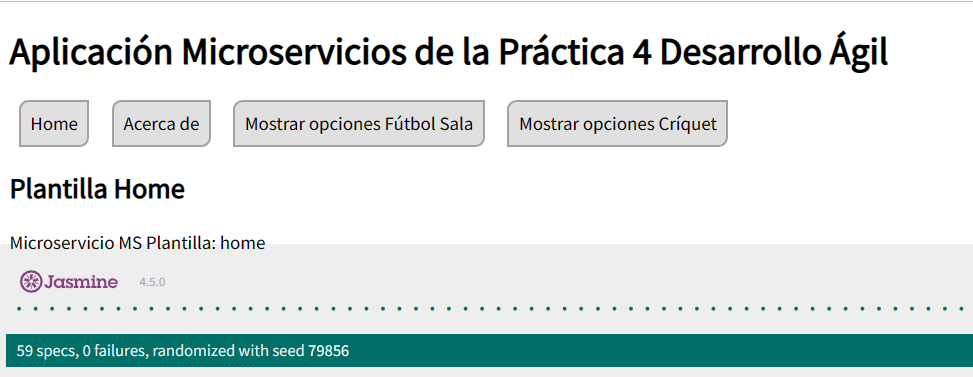
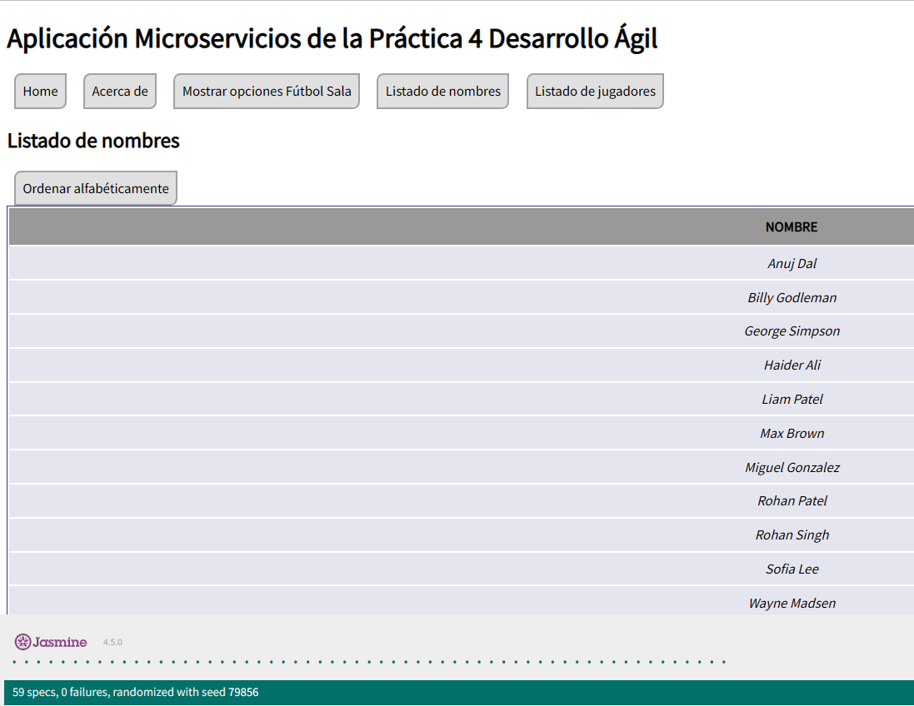
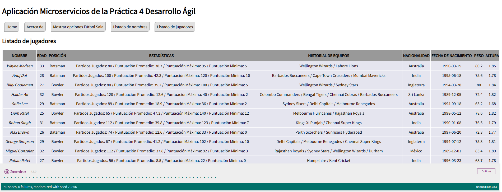

## **HU 4. Ofrecer en la aplicación toda la funcionalidad de la práctica individual creada por el/la estudiante Emilio Martínez Conchillo**

La página muestra un botón que al pulsarlo lista todos los atletas y otro botón que muestra la información del alumno: Emilio Martínez Conchillo

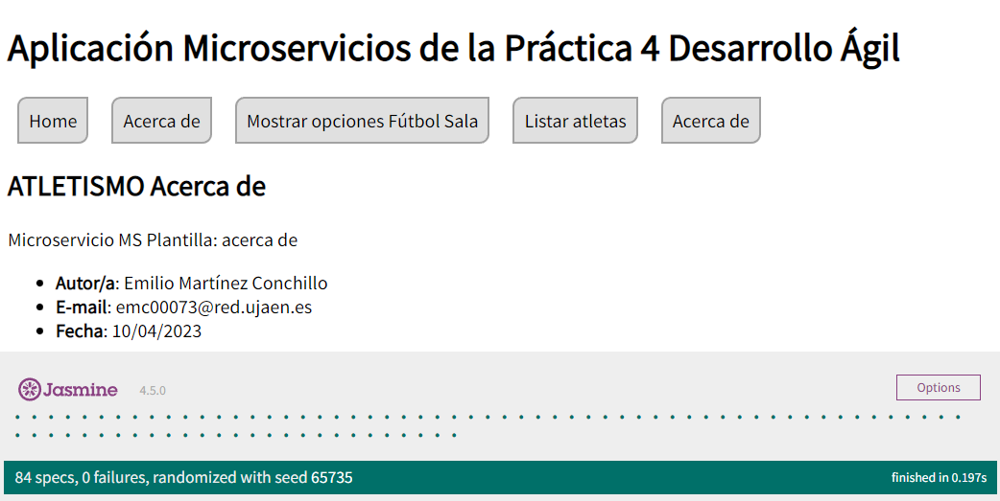
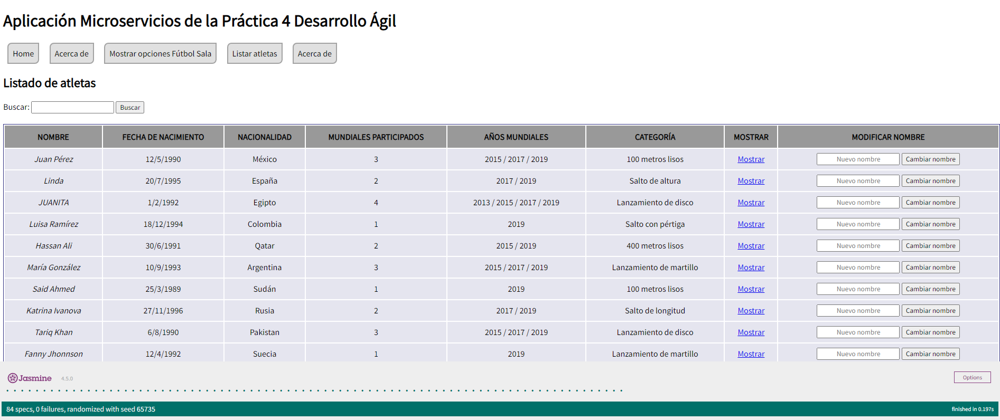

Pulsando sobre los nombres de las columnas podemos ordenarlas, cambiando su orden cada vez que se pulsa.

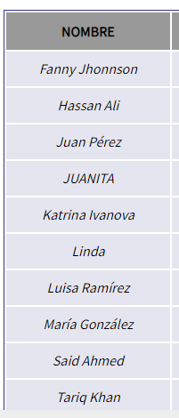 
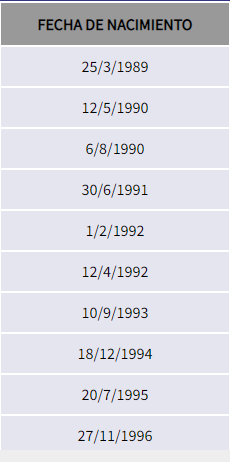 
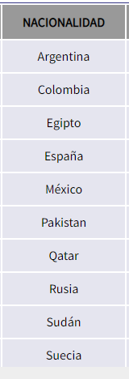 
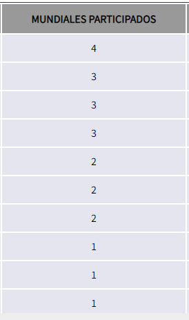
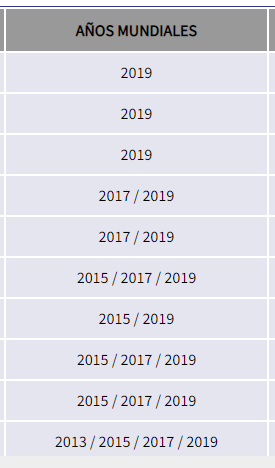

Escribiendo en la columna de cambiar nombre, podremos modificar el nombre de ese atleta en la base de datos, mostrándose los datos del atleta despues de pulsar el botón.

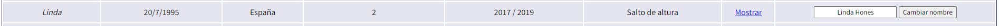

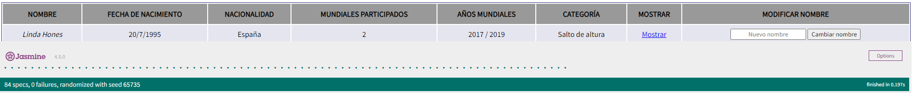

También podemos filtrar los atletas escribiendo en el buscador. Por ejemplo, escribiendo España, solo saldrán aquellos atletas de nacionalidad española.

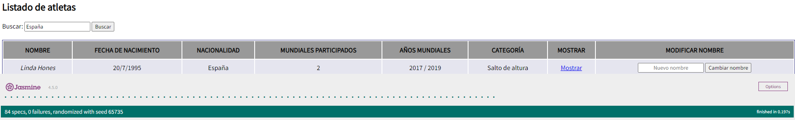

## **HU 5. Ofrecer en la aplicación toda la funcionalidad de la práctica individual creada por el/la estudiante Miguel Ángel Hurtado Molina**

Al igual que mi compañero Francisco José, la página muestra un botón que al pulsarlo despliega los botones de mi práctica:

Como podemos comprobar, las funcionalidades siguen funcionando correctamente:

## **HU 6. Ver en una sola página la información de todos los autores de la aplicación al pulsar en el botón “Acerca de”**

## **HU 7. Ver un listado solo con los nombres de todos los jugadores/equipos de todos los deportes incluidos en la app.**

Se ha añadido un botón a la página principal con el nombre "Nombres de todos los jugadores". Al pulsarlo aparecerá una tabla en la que se
listan los nombres de todos los jugadores/deportistas de la aplicación.

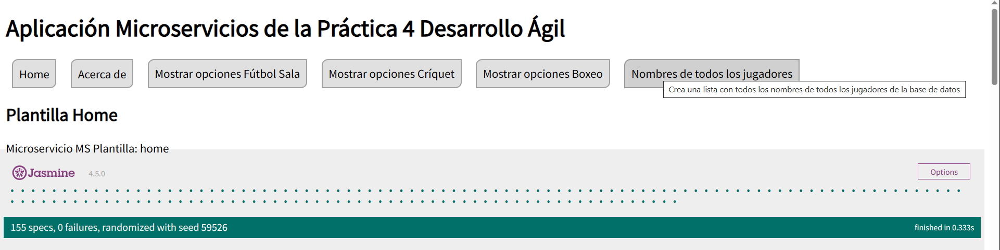
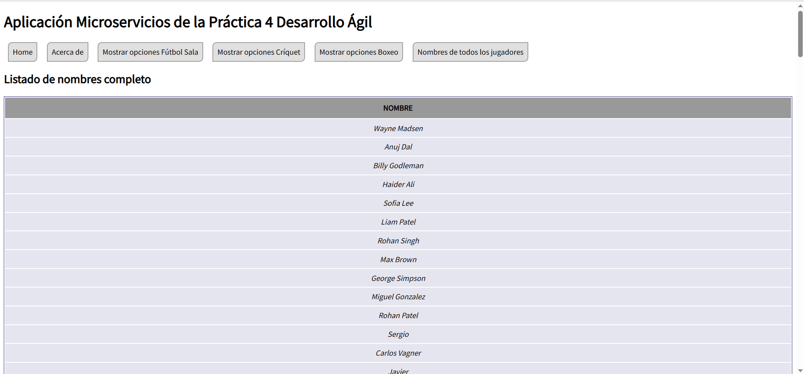

Se ha realizado añadiendo algunas funciones similares a las que se implementaron en la práctica anterior, para crear la tabla, recuperar
los datos de los jugadores, etc.

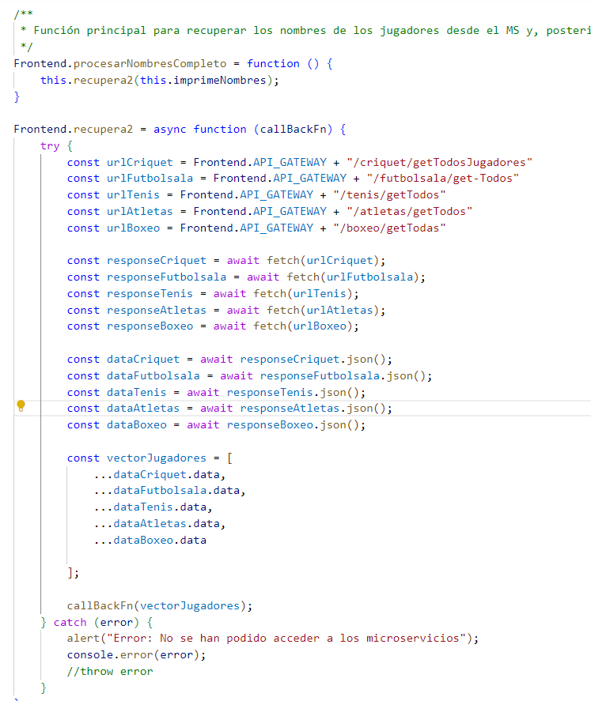
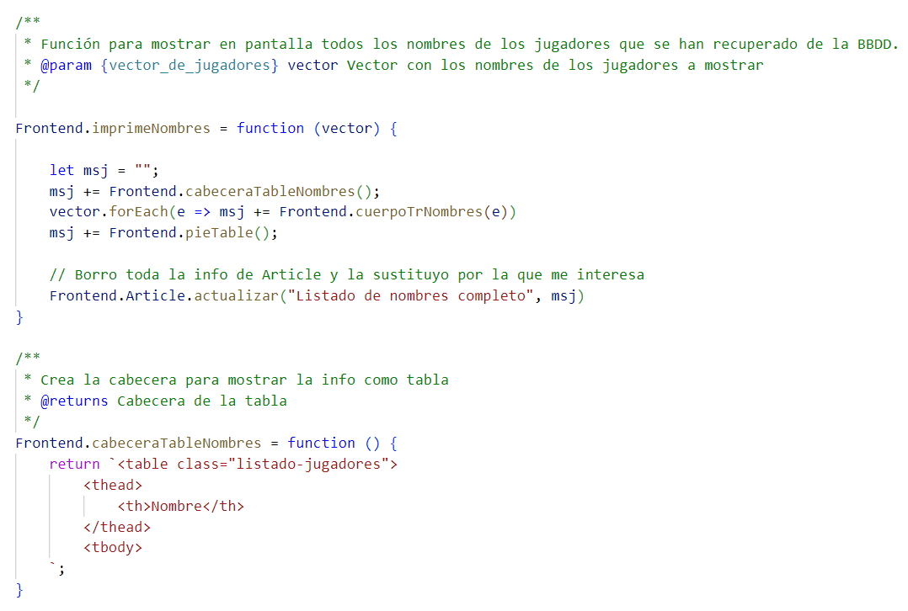
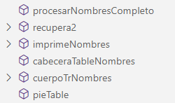

## **HU 8. Ver un listado solo con los nombres de todos los jugadores/equipos ordenados alfabéticamente de todos los deportes incluidos en la app. (Todos los nombres aparecerán ordenados en una sola tabla).**

Se ha implementado do forma que al pulsar sobre la cabecera de la tabla de nombres se ordene.
En la imagen vemos como aparecen los nombres sin ordenar
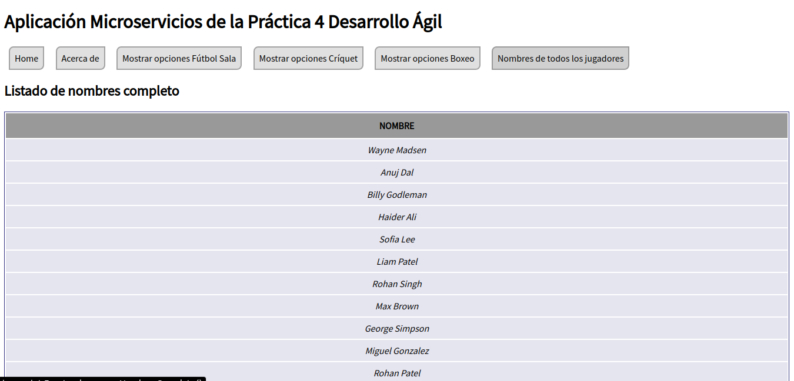
Despues de hacer click sobre la cabecera de la table vemos como se ordenan.
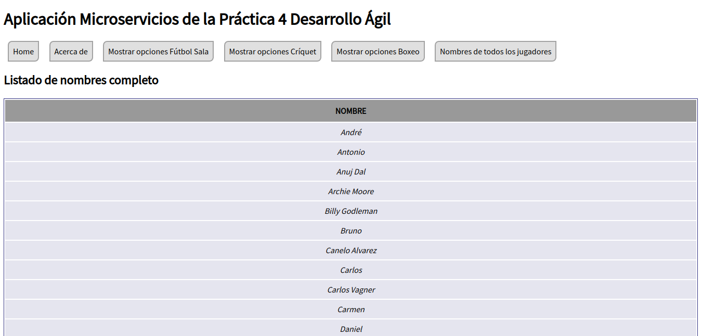

## **HU 9. Mostrar el nombre y el deporte de todos los jugadores/equipos que contengan una determinada cadena introducida por el usuario.**

Se ha añadido una nueva pestaña "Filtrar deportistas". 

Una vez dentro, se mostrará el listado completo de deportistas, junto a su deporte. 

Si escribimos una cadena en el buscador y pulsamos en el botón,
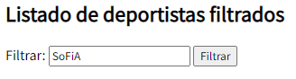 

todo el listado se filtrará mostrando únicamente aquellos deportistas cuyo nombre incluya esta cadena.

## **HU 10. Modificar la visualización de la app con un modo ALTO CONTRASTE.**

Se ha añadido un botón a la página principal

Al pulsarlo, se modifica el estilo de la página para que aparezca en alto contraste

Ejemplo del alto contraste en una tabla

## **HU 11. Mostrar un historial de las últimas 10 opciones que ha pulsado el usuario en nuestra app (desde que cargó/recargó la página web de la app).**

Se ha añadido un nuevo botón a la página principal.

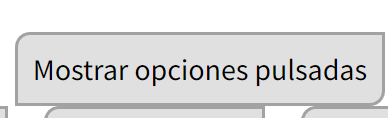

He implementado una nueva clase con la funcionalidad de una cola (queue).
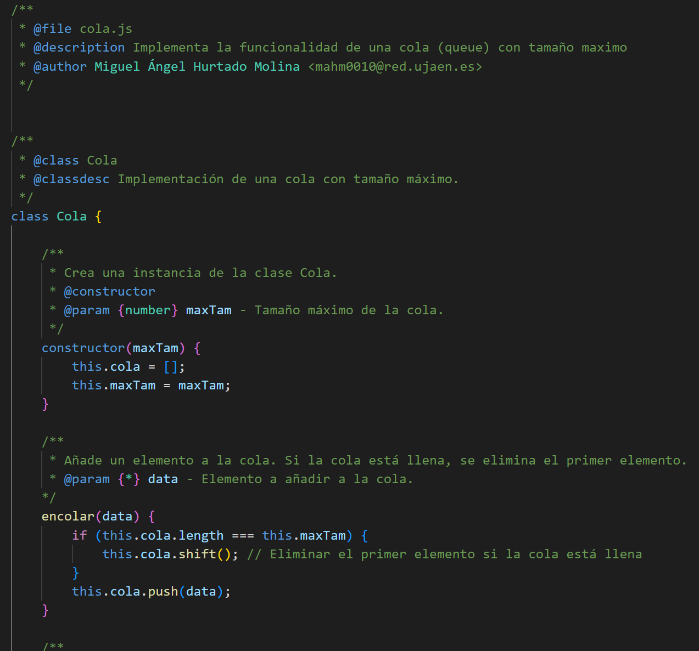

Esta nueva estructura de datos almacenará cadenas de caracteres con los botones pulsados por el usuario. Almacenando un número
máximo de 10 opciones pulsadas. Esto se hará cada vez que se pulse un botón desde el index.html.
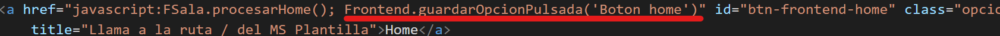

Se llamará a una nueva función del front-end que almacenará el texto en la cola. Por último se llamará a la función que construya
la tabla con las opciones pulsadas al hacer clic sobre el botón Mostrar opciones pulsadas.

A continuación muestro el resultado de la tabla en diferentes escenarios:

Al no haber pulsado opciones antes:
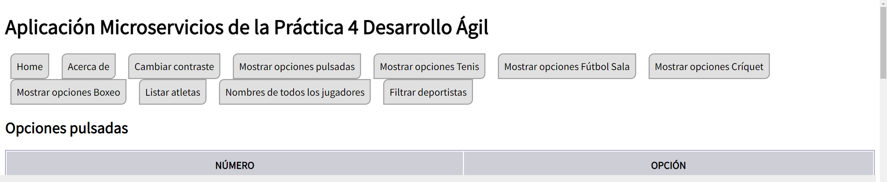

Al haber pulsado 5 opciones antes:
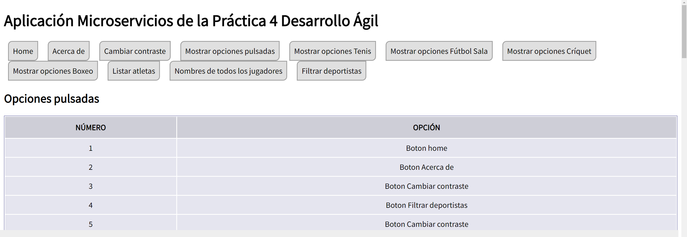

Al haber pulsado 10 opciones:
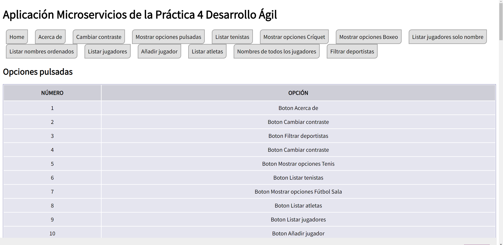

Al pulsar 11 opciones vemos que se borra la primera y se almacena la última:
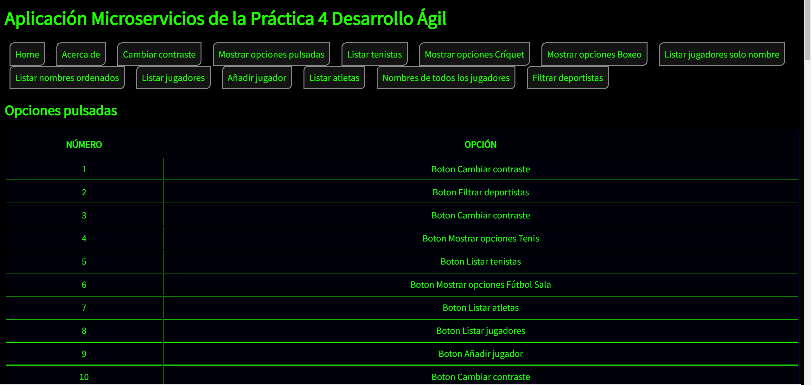

Al recargar la página se vacía la cola y por lo tanto empieza a contar desde cero:

